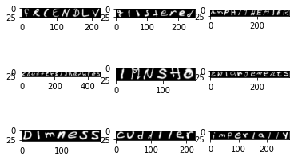

# The SNIST Dataset
> The Sequenced National Institute of Standards and Technology (SNIST) dataset is a brand-new dataset created based on the Extended Modified National Institute of Standards and Technology (EMNIST) dataset. EMNIST dataset is an extension of the Modified National Institute of Standards and Technology (MNIST) dataset which is a dataset that consists of a large number of handwritten digits that represent the numbers. The dataset is widely used for benchmarking of neural networks and the EMNIST dataset extends on that by adding handwritten characters of the English language. Each image in the MNIST and EMNIST datasets is normalized and has dimensions of 28 pixels by 28 pixels.

> The SNIST dataset is created by utilizing the characters provided by the EMNIST dataset and putting them into sequences. These sequences are then saved as images that represent words. The images have the same height of 28 pixels similar to the images found in the MNIST and EMNIST datasets. However, the width is different based on the size of the sequence of characters found in a word. Currently, The SNIST dataset consists of 150k images. However, there are plans to extend the dataset over a million images covering around 90k English words. The SNIST dataset is similar in vain to the MJSynth Dataset. Unlike MNIST and EMNIST datasets, The SNIST dataset is not intended for benchmarking purposes but rather it is intended to be an alternative to the MJSynth Dataset. The SNIST dataset also uses the same labeling structure as the MJSynth Dataset so that they can be interchangeable or used in tandem with each other. The figure below provides a sample of the new SNIST dataset.

>

> A sample set has been provided in this repository.
